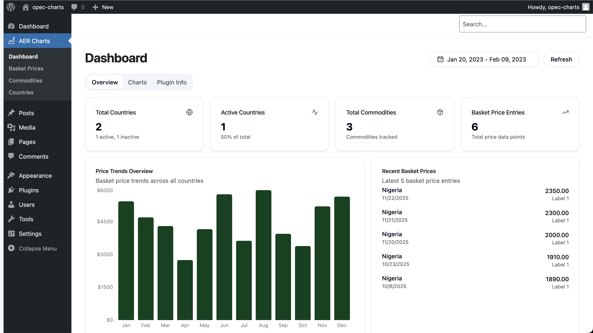
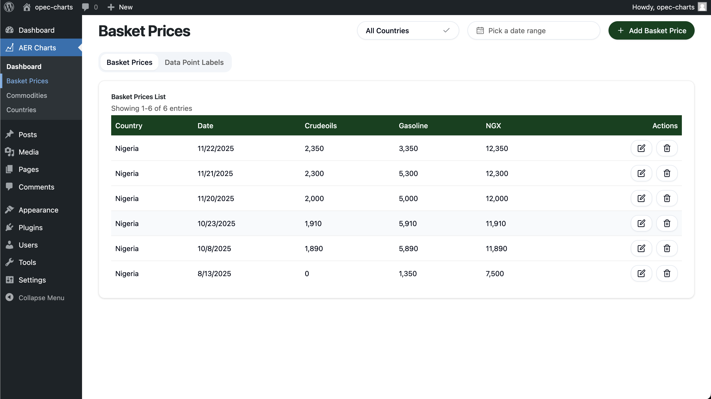
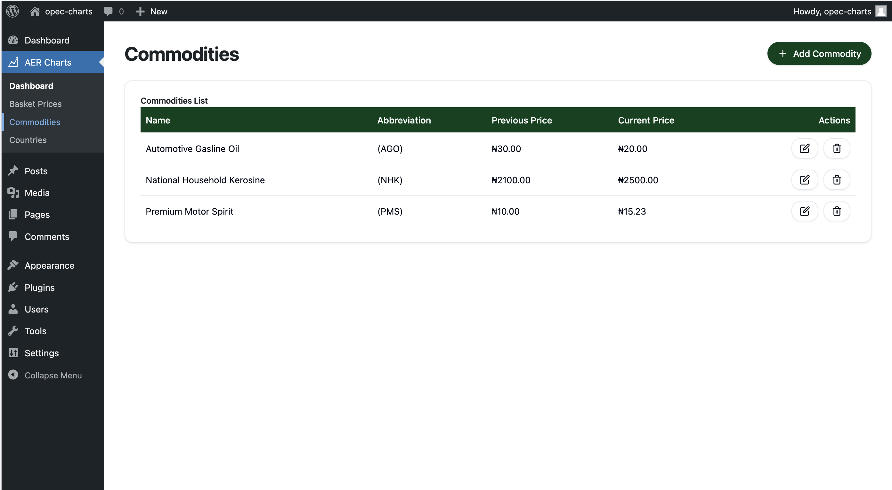
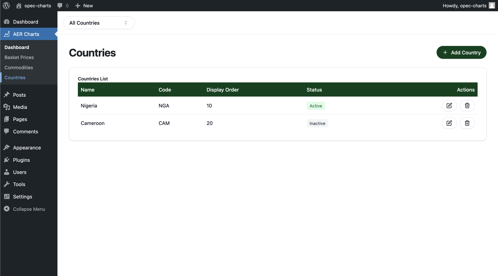
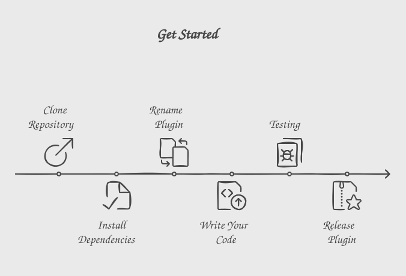

# African Energies Report Plugin
A plugin that helps African Energies Report Admins to  manage price data and display on desired page using short codes.

## Preview

<a href='https://prappo.github.io/wordpress-plugin-boilerplate/preview' target="_blank"></a>

## Screenshots

<table>
 
  <tr>
  <td></td>
  <td></td>
  </tr>
  <tr>
    <td></td>
    <td></td>
    
  </tr>
  
</table>


## Install using CLI tool

Install [PlugKit](https://github.com/prappo/plugkit). You can find the installation instructions from here [https://github.com/prappo/plugkit](https://github.com/prappo/plugkit)

To create a new WordPress plugin boilerplate.

```bash
plugkit create my-plugin
```
https://github.com/user-attachments/assets/39ab761e-ca40-4613-a88c-40620a1b2523

Or you can follow the manual installation process.
<details>
<summary><strong>Manual installation</strong></summary>

## Get Started
The plugin consists of two main components: the frontend, built with React, and the backend, which communicates via an API.

To get started, you need to clone the repository and install the dependencies. Then you can rename the plugin and start development. It's that simple!



## Clone the repository
```bash
git clone https://github.com/prappo/wordpress-plugin-boilerplate.git
```

## Install dependencies
```bash
npm install
composer install
```
## Plugin renaming

You can easly rename the plugin by changing data in `plugin-config.json` file.

```json
{
    "plugin_name":"WordPress Plugin Boilerplate",
    "plugin_description":"A boilerplate for WordPress plugins.",
    "plugin_version":"1.0.0",
    "plugin_file_name":"wordpress-plugin-boilerplate.php",
    "author_name":"Prappo",
    "author_uri":"https://prappo.github.io",
    "text_domain":"wordpress-plugin-boilerplate",
    "domain_path":"/languages",
    "main_class_name":"WordPressPluginBoilerplate",
    "main_function_name":"wordpress_plugin_boilerplate_init",
    "namespace":"WordPressPluginBoilerplate",
    "plugin_prefix":"wpb",
    "constant_prefix":"WPB"
}
```

Then run the following command to rename the plugin

```bash
npm run rename
```
</details>

## Add Shadcn UI

```bash
npx shadcn@latest add accordion
```
It will install the component in `src/components` folder.


## Structure

<details open>
  <summary><strong>📂 wordpress-plugin-boilerplate</strong></summary>
  <ul>
    <li>
    <details>
    <summary><strong>📂 config</strong></summary>
    <summary>
      <ul>
        <li><summary><strong>📄 plugin.php</strong></summary></li>
      </ul>
    </summary>
    </details>
    </li>
    <li>
    <details>
    <summary><strong>📂 database</strong></summary>
    <summary>
      <ul>
        <li>
        <details>
        <summary><strong>📂 Migrations</strong></summary>
        <ul>
          <li><summary><strong>📄 create_basket_prices_table.php</strong></summary></li>
          <li><summary><strong>📄 create_commodities_table.php</strong></summary></li>
        </ul>
        </details>
        </li>
        <li>
        <details>
        <summary><strong>📂 Seeders</strong></summary>
        <ul>
          <li><summary><strong>📄 BasketPricesSeeder.php</strong></summary></li>
          <li><summary><strong>📄 CountrySeeder.php</strong></summary></li>
        </ul>
        </details>
        </li>
      </ul>
    </summary>
    </details>
    </li>
    <li><details>
    <summary><strong>📂 includes</strong></summary>
    <ul>
      <li><summary><strong>📂 Admin</strong></summary></li>
      <li><summary><strong>📂 Controllers</strong></summary></li>
      <li><summary><strong>📂 Core</strong></summary></li>
      <li><summary><strong>📂 Frontend</strong></summary></li>
      <li><summary><strong>📂 Interfaces</strong></summary></li>
      <li><summary><strong>📂 Models</strong></summary></li>
      <li><summary><strong>📂 Routes</strong></summary></li>
      <li><summary><strong>📂 Traits</strong></summary></li>
      <li><summary><strong>📄 functions.php</strong></summary></li>
    </ul>
    </details>
    </li>
    <li><details>
    <summary><strong>📂 src</strong></summary>
    <ul>
      <li><summary><strong>📂 admin</strong></summary></li>
      <li><summary><strong>📂 frontend</strong></summary></li>
      <li><summary><strong>📂 components</strong></summary></li>
      <li><summary><strong>📂 lib</strong></summary></li>
      <li><summary><strong>📂 blocks</strong></summary></li>
    </ul>
    </details>
    </li>
    <li><summary><strong>📂 libs</strong></summary></li>
    <li><summary><strong>📂 views</strong></summary></li>
    <li><summary><strong>📂 vendor</strong></summary></li>
    <li><summary><strong> 📄 plugin.php</strong></summary></li>
    <li><summary><strong> 📄 uninstall.php</strong></summary></li>
    <li><summary><strong> 📄 wordpress-plugin-boilerplate.php</strong></summary></li>
  </ul>
</details>

### API Route

Add your API route in `includes/Routes/Api.php`

```php
Route::get( $prefix, $endpoint, $callback, $auth = false );
Route::post( $prefix, $endpoint, $callback, $auth = false );

// Route grouping.
Route::prefix( $prefix, function( Route $route ) {
    $route->get( $endpoint, $callback, $auth = false );
    $route->post( $endpoint, $callback, $auth = false );
});
```

## ORM ( Object Relational Mapping )

If you are familiar with Laravel, you will find this ORM very familiar. It is a simple and easy-to-use ORM for WordPress.

You can find the ORM documentation [here](https://github.com/prappo/wp-eloquent)

Create your model in `includes/Models` folder.


## Passing data from backend to frontend

Just pass your data to the array in the Asset file.

For example: For admin:

https://github.com/prappo/wordpress-plugin-boilerplate/blob/8d982b63f50beb1dffd43c29bff894814b5e7945/includes/Assets/Frontend.php#L104-L110

And access data on react like this 

https://github.com/prappo/wordpress-plugin-boilerplate/blob/8d982b63f50beb1dffd43c29bff894814b5e7945/src/frontend/components/application-layout/LayoutOne.jsx#L58

Remember the object `wordpressPluginBoilerplateFrontend` name can be defined here 

https://github.com/prappo/wordpress-plugin-boilerplate/blob/8d982b63f50beb1dffd43c29bff894814b5e7945/includes/Assets/Frontend.php#L30

## Shortcode

To display the basketprice chart using this `Shortcode` 
 ```bash 
 [aer_basket_prices]
 ```

and the commodities data using this
 ```bash 
 [aer_commodities]
 ```

## Development

```bash
npm run dev
```
If you want to run only frontend or admin you can use the following commands:

```bash
npm run dev:frontend
npm run dev:admin
```

## Development with server

```bash
npm run dev:server
```

## Build

```bash
npm run build
```
## Developing block

```bash
npm run block:start
```

## Build block

```bash
npm run block:build
```

## Release

```bash
npm run release
```

It will create a relase plugin in `release` folder


